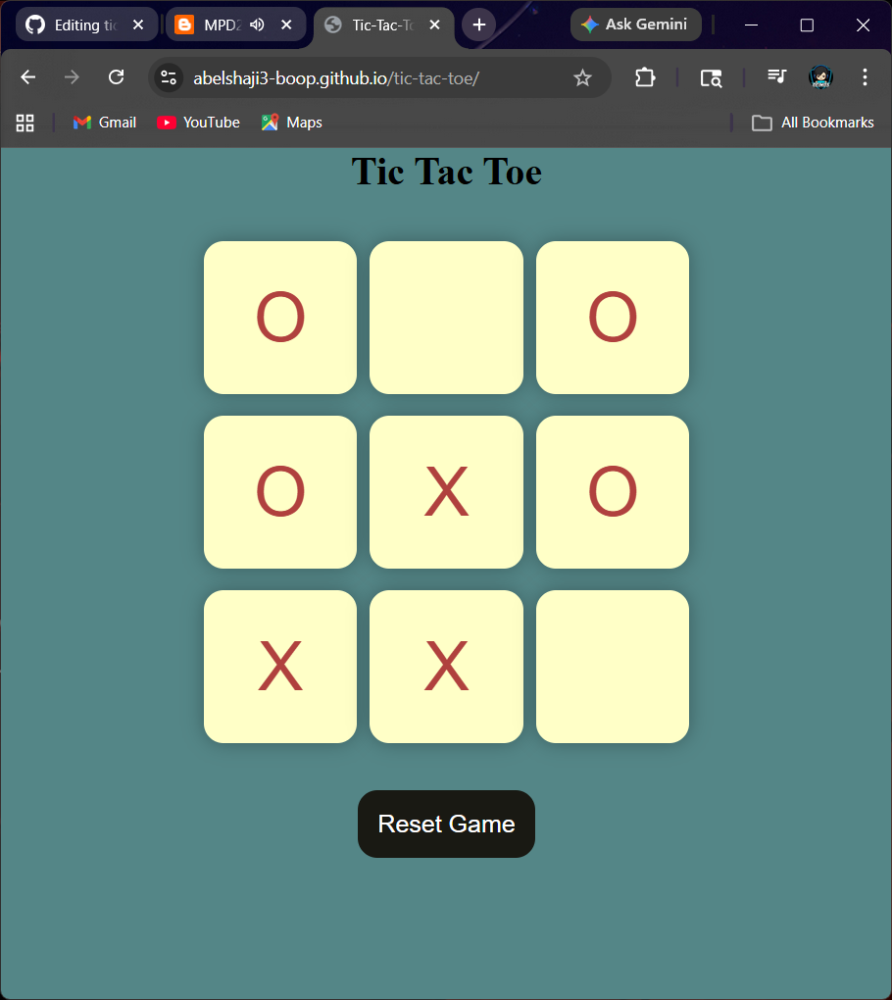

# ❌⭕ Tic Tac Toe Game

A simple and interactive Tic Tac Toe game built using **HTML, CSS, and JavaScript**.  
This project focuses on DOM manipulation, game logic, and smooth user interaction.

---

## 🌐 Live Demo 
[👉Click here to view](https://abelshaji3-boop.github.io/tic-tac-toe/)

---

## 🚀 Features
- 🎮 Two-player game (X vs O)
- 🔁 Reset and New Game functionality
- 🧠 Win detection logic
- 🤝 Draw detection
- ✨ Smooth click and pop animations
- 📱 Clean and responsive UI

---

## 🛠 Tech Stack
- HTML  
- CSS  
- JavaScript  

---

## 📸 Preview

---
